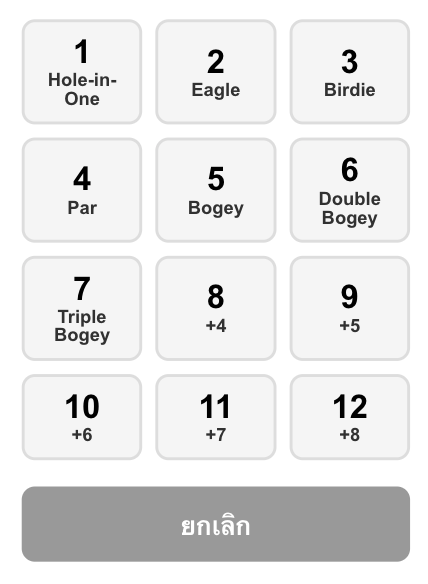
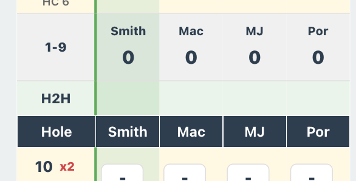

## Remain Copilot to aware that we have this kind of data

=== Smith vs Mac ===
h2hScoring.js:196 Hole | Par | Turbo | PlayerGross | OpponentGross | PlayerNet | OpponentNet | HC | ScoreType | BasePoint | HolePoint | Result | PlayerDelta
h2hScoring.js:197 -----|-----|-------|-------------|---------------|-----------|-------------|-------|-----------|-----------|-----------|--------|------------
h2hScoring.js:201 H 1 | 4 | x2 |  - |  - |  - |  - | None   | -      | 0 | 0 | PENDING | +0
h2hScoring.js:201 H 2 | 3 | x1 |  - |  - |  - |  - | None   | -      | 0 | 0 | PENDING | +0
h2hScoring.js:201 H 3 | 5 | x1 |  - |  - |  - |  - | Give1  | -      | 0 | 0 | PENDING | +0
h2hScoring.js:201 H 4 | 4 | x1 |  - |  - |  - |  - | Give1  | -      | 0 | 0 | PENDING | +0
h2hScoring.js:201 H 5 | 3 | x1 |  - |  - |  - |  - | None   | -      | 0 | 0 | PENDING | +0
h2hScoring.js:201 H 6 | 4 | x1 |  - |  - |  - |  - | Give1  | -      | 0 | 0 | PENDING | +0
h2hScoring.js:201 H 7 | 4 | x2 |  - |  - |  - |  - | None   | -      | 0 | 0 | PENDING | +0
h2hScoring.js:201 H 8 | 4 | x2 |  - |  - |  - |  - | None   | -      | 0 | 0 | PENDING | +0
h2hScoring.js:201 H 9 | 5 | x3 |  - |  - |  - |  - | None   | -      | 0 | 0 | PENDING | +0
h2hScoring.js:201 H10 | 4 | x2 |  - |  - |  - |  - | None   | -      | 0 | 0 | PENDING | +0
h2hScoring.js:201 H11 | 3 | x1 |  - |  - |  - |  - | None   | -      | 0 | 0 | PENDING | +0
h2hScoring.js:201 H12 | 4 | x1 |  - |  - |  - |  - | None   | -      | 0 | 0 | PENDING | +0
h2hScoring.js:201 H13 | 5 | x1 |  - |  - |  - |  - | None   | -      | 0 | 0 | PENDING | +0
h2hScoring.js:201 H14 | 3 | x1 |  - |  - |  - |  - | None   | -      | 0 | 0 | PENDING | +0
h2hScoring.js:201 H15 | 4 | x1 |  - |  - |  - |  - | None   | -      | 0 | 0 | PENDING | +0
h2hScoring.js:201 H16 | 4 | x2 |  - |  - |  - |  - | None   | -      | 0 | 0 | PENDING | +0
h2hScoring.js:201 H17 | 5 | x2 |  - |  - |  - |  - | None   | -      | 0 | 0 | PENDING | +0
h2hScoring.js:201 H18 | 4 | x3 |  - |  - |  - |  - | None   | -      | 0 | 0 | PENDING | +0
h2hScoring.js:204 
--- SUMMARY ---
h2hScoring.js:205 Total Points: +0
h2hScoring.js:206 WIN: 0 | LOSE: 0 | TIE: 0 | PENDING: 18

=== Smith vs MJ ===
h2hScoring.js:196 Hole | Par | Turbo | PlayerGross | OpponentGross | PlayerNet | OpponentNet | HC | ScoreType | BasePoint | HolePoint | Result | PlayerDelta
h2hScoring.js:197 -----|-----|-------|-------------|---------------|-----------|-------------|-------|-----------|-----------|-----------|--------|------------
h2hScoring.js:201 H 1 | 4 | x2 |  - |  - |  - |  - | None   | -      | 0 | 0 | PENDING | +0
h2hScoring.js:201 H 2 | 3 | x1 |  - |  - |  - |  - | None   | -      | 0 | 0 | PENDING | +0
h2hScoring.js:201 H 3 | 5 | x1 |  - |  - |  - |  - | None   | -      | 0 | 0 | PENDING | +0
h2hScoring.js:201 H 4 | 4 | x1 |  - |  - |  - |  - | None   | -      | 0 | 0 | PENDING | +0
h2hScoring.js:201 H 5 | 3 | x1 |  - |  - |  - |  - | None   | -      | 0 | 0 | PENDING | +0
h2hScoring.js:201 H 6 | 4 | x1 |  - |  - |  - |  - | None   | -      | 0 | 0 | PENDING | +0
h2hScoring.js:201 H 7 | 4 | x2 |  - |  - |  - |  - | None   | -      | 0 | 0 | PENDING | +0
h2hScoring.js:201 H 8 | 4 | x2 |  - |  - |  - |  - | None   | -      | 0 | 0 | PENDING | +0
h2hScoring.js:201 H 9 | 5 | x3 |  - |  - |  - |  - | None   | -      | 0 | 0 | PENDING | +0
h2hScoring.js:201 H10 | 4 | x2 |  - |  - |  - |  - | None   | -      | 0 | 0 | PENDING | +0
h2hScoring.js:201 H11 | 3 | x1 |  - |  - |  - |  - | None   | -      | 0 | 0 | PENDING | +0
h2hScoring.js:201 H12 | 4 | x1 |  - |  - |  - |  - | None   | -      | 0 | 0 | PENDING | +0
h2hScoring.js:201 H13 | 5 | x1 |  - |  - |  - |  - | None   | -      | 0 | 0 | PENDING | +0
h2hScoring.js:201 H14 | 3 | x1 |  - |  - |  - |  - | None   | -      | 0 | 0 | PENDING | +0
h2hScoring.js:201 H15 | 4 | x1 |  - |  - |  - |  - | None   | -      | 0 | 0 | PENDING | +0
h2hScoring.js:201 H16 | 4 | x2 |  - |  - |  - |  - | None   | -      | 0 | 0 | PENDING | +0
h2hScoring.js:201 H17 | 5 | x2 |  - |  - |  - |  - | None   | -      | 0 | 0 | PENDING | +0
h2hScoring.js:201 H18 | 4 | x3 |  - |  - |  - |  - | None   | -      | 0 | 0 | PENDING | +0
h2hScoring.js:204 
--- SUMMARY ---
h2hScoring.js:205 Total Points: +0
h2hScoring.js:206 WIN: 0 | LOSE: 0 | TIE: 0 | PENDING: 18

## Develop One Table (everyone can see this table) call Animal

Hole | Player 1 | Player 2 | Player 3 | ... |
---|---|---|---|---
1 | 2 | 1 | 2 | ...
2 | 0 | 0 | 1 | ...
3 | 1 | 1 | 1 | ...
...

this table will use to stor penelty point (input manul hole-by-hole) by double tap at Hole #1

Input style: level below stlye 

the idea is at the selected hole the span diaglog show:
Animal Type| Player 1 | Player 2 | Player 3 | ... |
🐒 (Monkey) |  0   |  1   |  0   |  0  | ...
🦒 (giraffe)
🐍 (Snake) |  0 | 0 | 1 | 0
🐪 (Camel)
🐸 (Frog)
🐊 (Monitor lizard)

-----

the idea is to key in animal type and number of shot made in each categories of each person,

## Point 
1) Sum all points (of each animal) per player
2) Multiple by Hole Turbo point (x1, x2, x3, ...) based on hole turbo point
3) Summarize all player animal
4) Generate table and display it as same debug information

## Display point seperatly between 1-9 and 10-18

display below H2H, the row name is Animal